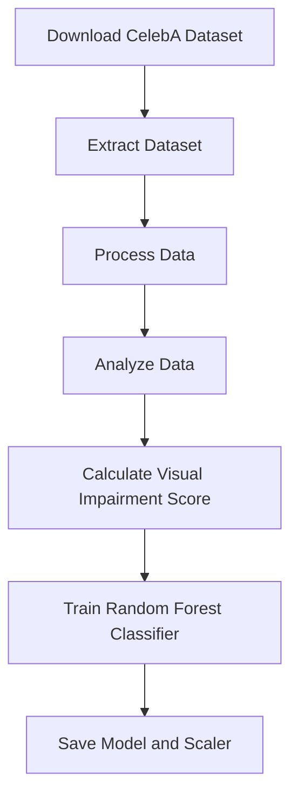
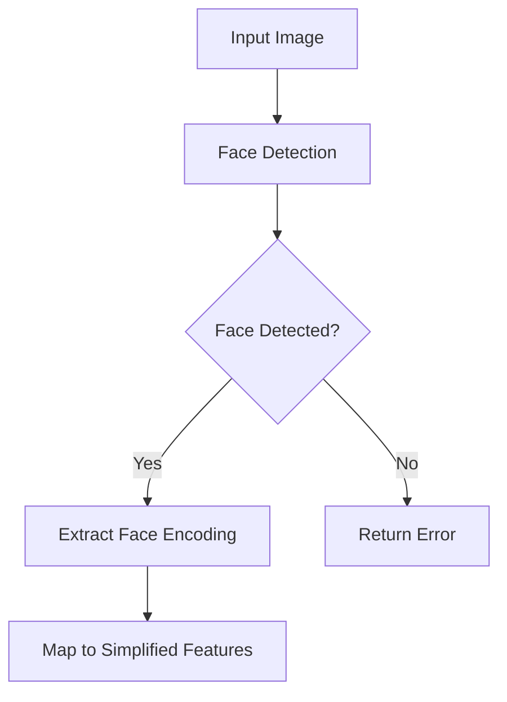
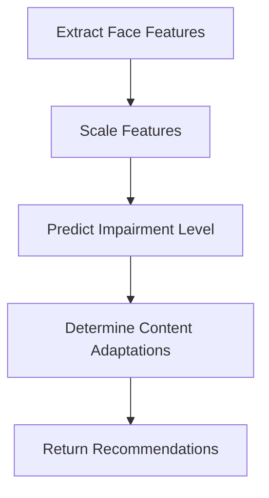
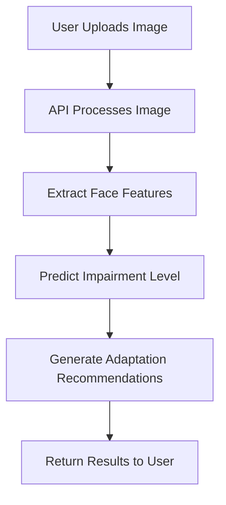

# Visual Impairment Prediction and Content Adaptation System

## Overview

This system combines computer vision techniques for face analysis with machine learning to predict visual impairment levels and provide content adaptation recommendations. The model is trained on the CelebA dataset, using relevant facial features to estimate the likelihood of visual impairment. The content adaptation suggestions aim to improve accessibility for users with different levels of visual abilities.

## System Components

### 1. Data Processing and Model Training

Description:
1. The CelebA dataset is downloaded and extracted.
The data is processed, combining attribute annotations and partition information.
Relevant features for visual impairment are selected and analyzed.
4. A visual impairment score is calculated based on selected features.
A Random Forest Classifier is trained to predict visual impairment levels (Low, Medium, High).
The trained model and scaler are saved for later use.

2. Feature Extraction
Description:
1. An input image is provided for analysis.
Face detection is performed using the face_recognition library.
3. If a face is detected, face encoding is extracted.
The face encoding is mapped to simplified features (e.g., Eyeglasses, Narrow_Eyes, etc.).
If no face is detected, an error is returned.
3. Content Adaptation
Description:
Face features are extracted from the input image.
2. The features are scaled using the pre-trained scaler.
The Random Forest Classifier predicts the visual impairment level.
Based on the prediction, content adaptations are determined.
Recommendations for font size and content density are returned.
Overall System Flow
Description:
A user uploads an image through the API.
2. The API processes the image and extracts face features.
3. The pre-trained model predicts the visual impairment level.
Content adaptation recommendations are generated based on the prediction.
The results are returned to the user, including the predicted impairment level, recommended font size, and content density.

### 2. Feature Extraction

#### Description:
1. An input image is provided for analysis.
2. Face detection is performed using the face_recognition library.
3. If a face is detected, face encoding is extracted.
4. The face encoding is mapped to simplified features (e.g., Eyeglasses, Narrow_Eyes, etc.).
5. If no face is detected, an error is returned.

### 3. Content Adaptation

#### Description:
1. Face features are extracted from the input image.
2. The features are scaled using the pre-trained scaler.
3. The Random Forest Classifier predicts the visual impairment level.
4. Based on the prediction, content adaptations are determined.
5. Recommendations for font size and content density are returned.

## Overall System Flow

#### Description:
1. A user uploads an image through the API.
2. The API processes the image and extracts face features.
3. The pre-trained model predicts the visual impairment level.
4. Content adaptation recommendations are generated based on the prediction.
5. The results are returned to the user, including the predicted impairment level, recommended font size, and content density.

## Technologies Used

- Next.js
- Elysia
- FastAPI
- Google Cloud
- React
- Drizzle
- scikit-learn
- OpenCV
- Seaborn
