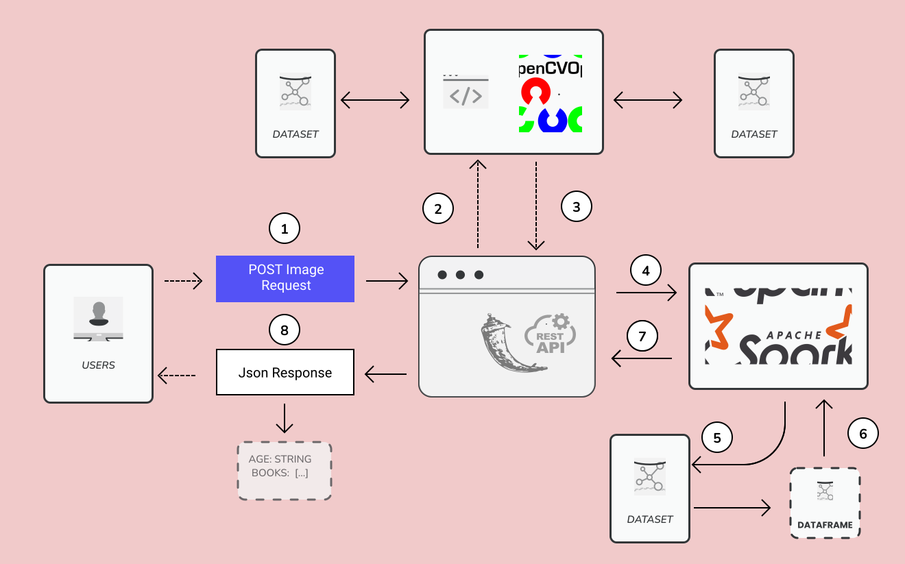
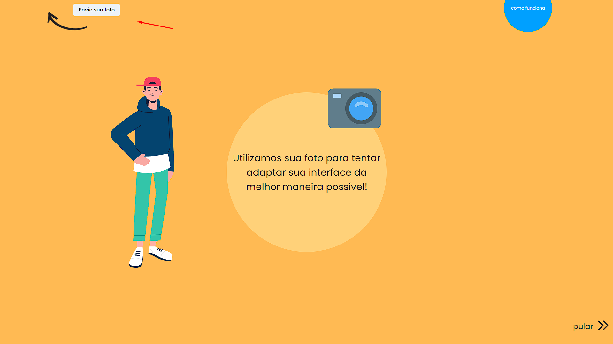

# Readapt

### Improve the experience of reading ebooks through a queue of recommendations in multiple parts.

Readapt was born with the goal of improving the experience of reading ebooks through a queue of recommendations in multiple parts.

Using the user's photo, we draw a profile that helps both accessibility and customization of the reader. From the spread of content to the size of the font, we focus on bringing the best experience possible without the need of manual configuration of the user.

The system is based on a machine learning model that estimates the user's age, which is then sent to the filter that, above a dataset of books, separates and returns a dataframe corresponding to the recommendations.

The system was built using the programming language Python for the server, the framework flask for the implementation of REST, the openCV library for the training of image models and the distributed computing framework pySpark for the construction of the recommendation model, being it maintained and filtered in a dataframe.

### Architecture





### Operation


1. The client sends an image to the server through the route /upload.
2. The server receives the image and sends it to the age classification algorithm of openCV.
3. The algorithm returns the estimated age.
4. The server sends the estimated age to the pySpark system for the recommendation of ebooks.
5. The pySpark system uses the RDD(Resilient Distributed Datasets) to manipulate the dataset of ebooks with base on the estimated age of the user.
6. The system returns the recommended ebooks.
7. The pySpark system sends the Dataframe of recommendation to the server.
8. The server returns the Dataframe of recommendation to the client, together with the estimated age.
### Motulos utilizados

- [Opencv-python](https://pypi.org/project/opencv-python/) - Biblioteca de código aberto para o processamento de imagens.
- [Flask](https://flask.palletsprojects.com/en/1.1.x/) - Framework de desenvolvimento web.
- [PySpark](https://spark.apache.org/docs/latest/api/python/) - Framework de código aberto para o processamento de dados.
- [Numpy](https://numpy.org/) - Biblioteca de código aberto para o processamento de dados.
- [OS](https://docs.python.org/3/library/os.html) - Biblioteca de código aberto para o operação de sistema.
### How to use Readapt

#### Client:
```
~$ npm i
~$ yarn dev
```

#### Server:

```
~$ pip install pyspark
~$ pip install flask
~$ pip install opencv-python
~$ pip install numpy
~$ python ./backend/app.py
```


